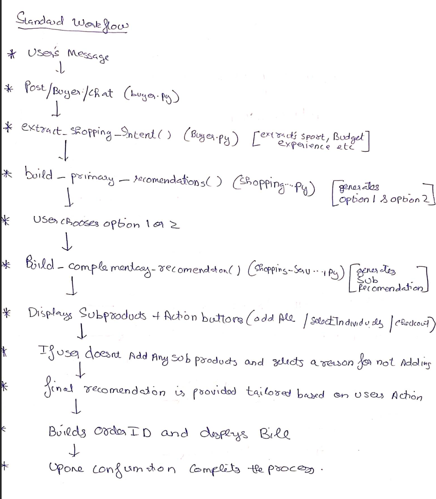
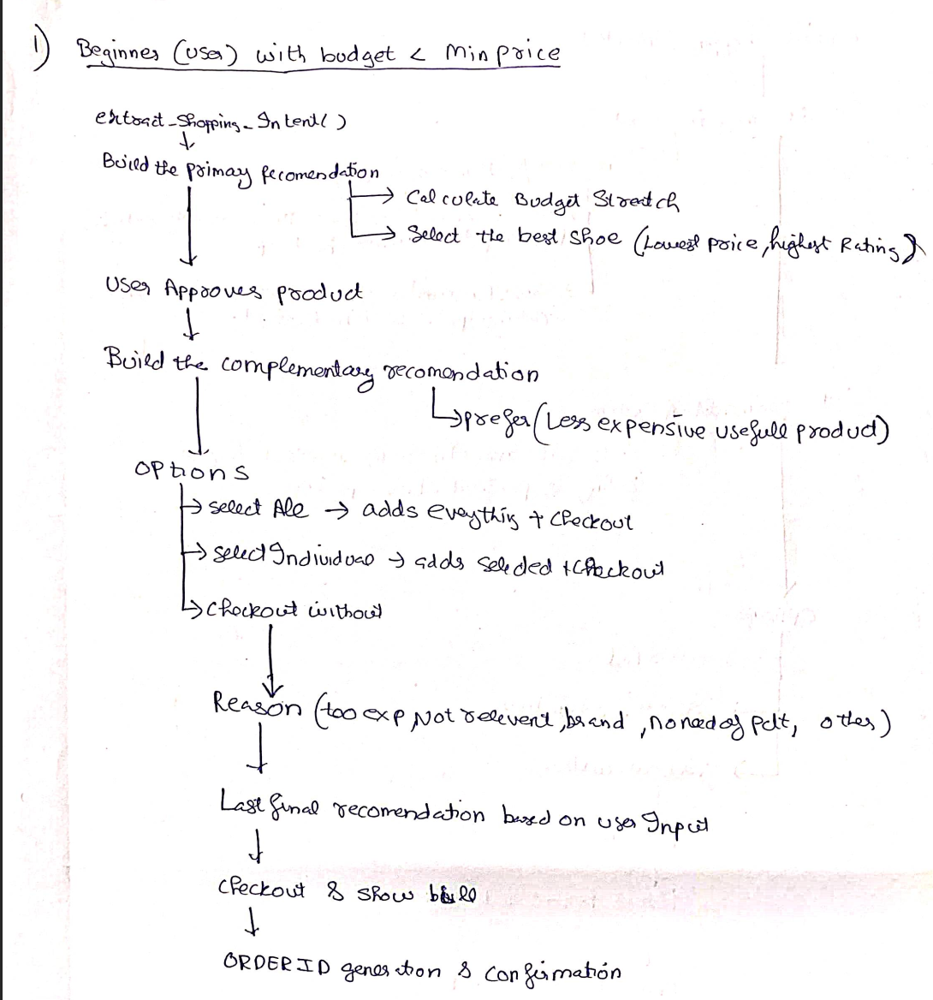
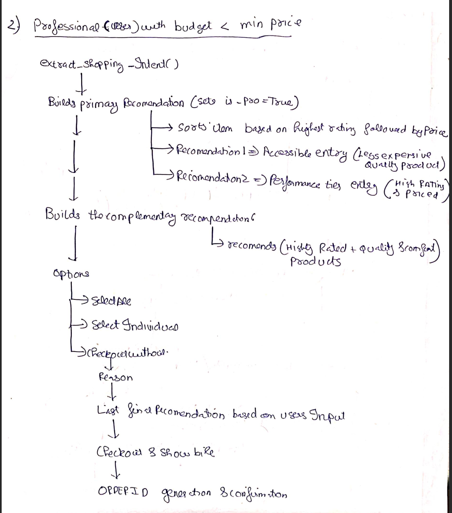
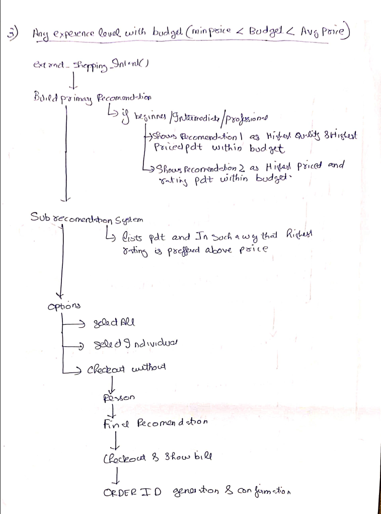
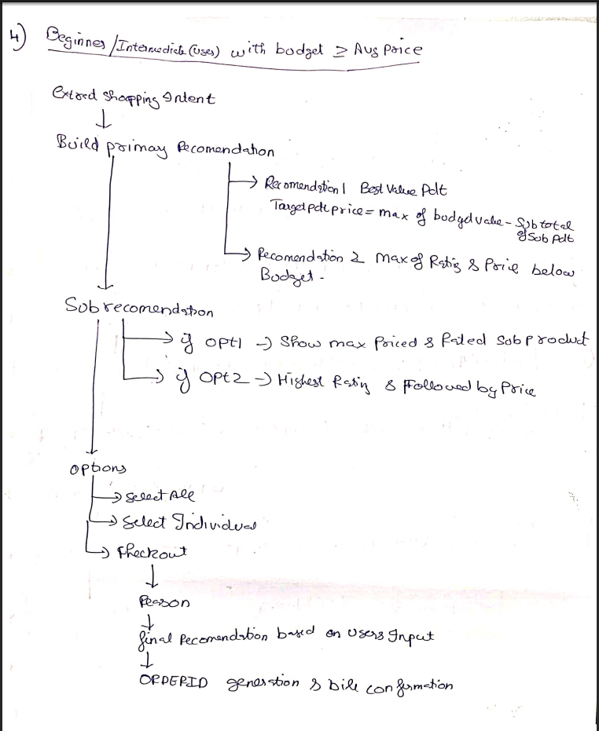
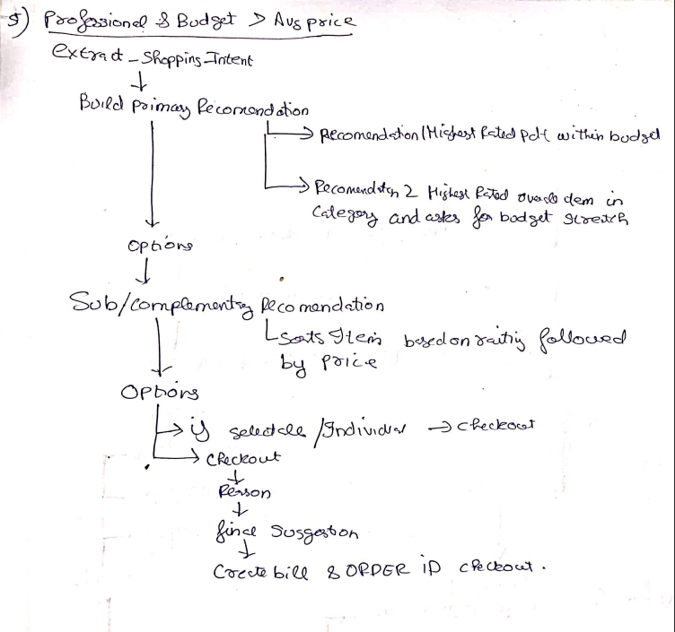

# AgentPay: AI Growth & Agentic Commerce Engine

AgentPay is an AI-powered commerce engine built on Razorpay APIs. It turns static merchant stores into AI-transactable endpoints, boosting merchant revenue through smart, budget-aware cross-selling and automated abandoned cart recovery.

---
## AGENTPAY explained through a simple example 

Suppose user wants a product say a running shoe. user tells the need to ai agent of AGENTPAY " i want a pair of running shoes" . AGENTPAY extracts users input and identifies the sports "running" then asks follo up questions "whats users budget" (5000,4000 etc) and how exerienced the user is (professional,Intermediate, beginner )" and then based on the information user has given AGENTPAY's primaryrecomendation system gets called which comprises of 5 search algorithm select primary product (running shoes) and secondary recomended list of products (socks, head-band,shorts etc) that are related to the sports (running in this example) and recomend it in such a way that the users need as well as purpose is satisfied and moreover makes user buy products near to or above the budget provided in the beginning of the session .

* **Base Algorithm:** Every decision tree algorithm builds on this foundational workflow:  
[](algorithms/Base_algorithm.png)

* **Algorithm 1:** Beginner / Intermediate user with a budget below the minimum product price  
[](algorithms/ALGORITHM_1.png)

* **Algorithm 2:** Professional user with a budget below the minimum product price  
[](algorithms/ALGORITHM_2.png)

* **Algorithm 3:** Any skill level with a budget between minimum and average market price  
[](algorithms/ALGORITHM_3.png)

* **Algorithm 4:** Beginner / Intermediate user with a budget above average market price (includes sub-recommendations)  
[](algorithms/ALGORITHM_4.png)

* **Algorithm 5:** Professional user with a budget above average market price (includes pro stretch & accessories)  
[](algorithms/ALGORITHM_5.png)

---

## Key Capabilities

### 1. Conversational Shopping & Budget Allocation
- Supports 5 persona and budget decision cases based on user expertise (*Beginner, Intermediate, Professional*) and specified budget parameters.
- Recommends primary products alongside compatible accessories (e.g., Badminton Racket + Shuttlecocks + Grip).
- Calculates target budget allocation dynamically (`Target Price = Budget - Accessories Cost`) to optimize basket value within user bounds.

### 2. Multi-Merchant Catalog API
- Aggregates inventory across four partner merchants: **Amazon**, **Flipkart**, **Tata-CLiQ**, and **Ajio**.
- Provides structured JSON endpoints for AI buyers to query stock levels, unit pricing, ratings, and merchant policy caps.

### 3. Real-Time Cart State Synchronization
- Reactive cart state updates immediately upon selecting recommendations.
- Provides real-time remaining budget calculations and context feedback.

### 4. AI Revenue Recovery Service
- Detects abandoned carts when users exit or drop off prior to checkout.
- Triggers policy-bounded recovery interventions (e.g., a single 5% flash discount offer).
- Enforces a strict **stopping rule** (maximum 1 intervention per session) to prevent redundant messaging.

### 5. Gated Payment Execution & Audit Trail
- All financial operations enforce execution gating (`checkout_gated: True`) requiring user authorization.
- Generates order payloads verified via SHA-256 HMAC digital signatures.
- Maintains an audit log stream tracking all financial events and policy checks.

### 6. Graceful Failure & Cart Recovery
- Handles transaction drops and network interruptions by maintaining session state.
- Exposes a recovery endpoint (`/api/recovery`) to restore carts and re-issue checkout tokens without data loss.

---

## Impact of this project and how this idea was developed

Customers are attracted based on trust and satisfaction they recieve.I believe if a system can provide that to users naturally the entire business eco-system develops . 

This project is inspired by a personal experience from my first year of university.

As a freshman studying far from home, I was still unfamiliar with the routes and nearby railway stations. One day, I was in a hurry to catch a train at a railway station, which was nearly 15 km away. I booked a taxi, hoping that I would reach the station on time. However, during the journey, the driver asked me about my destination and the reason for my trip. After understanding my situation, he suggested that I take a nearby railway station instead.

The driver would have earned an additional ₹150 if he had driven me all the way to my original destination. Instead, he checked whether my train stopped at the nearby station, confirmed that it did, and took me there. Fortunately, I reached the station five minutes before my train and saved ₹150.

At first glance, it may seem like the driver took a loss by helping me. However, that single decision created trust. Since that first ride, I have travelled with him more than 20 times to different locations, generating significantly more value for him than the ₹150 he gave up that day.

This experience became the core idea behind my project.

Instead of simply recommending the most expensive product or maximizing the value of a single transaction, the system is designed to understand the user's actual needs and find the most useful products for them. It can recommend alternatives that may be cheaper, suggest complementary products that provide additional value, and, when appropriate, encourage users to consider products slightly above their initial budget by clearly highlighting the additional value they provide.

The underlying philosophy is simple: a transaction should not be optimized only for the immediate purchase. It should create value for all three sides — the user, the merchant, and the platform.

For the user, the goal is to discover products that genuinely fit their needs and provide meaningful value. For merchants, the system can increase the likelihood of a purchase by presenting relevant products and useful alternatives. For the platform, this creates opportunities for higher-value transactions while maintaining a positive user experience.

Just like the taxi driver who gave up ₹150 in the short term but gained a long-term customer through a helpful decision, this project follows the principle that creating value for the user can ultimately create greater value for everyone involved.

This is the approach I have tried to incorporate into the search and recommendation algorithm of this project.


## Tech Stack

- **Backend:** Python 3.12, FastAPI, SQLAlchemy, Pydantic v2, SQLite
- **Payment Gateway:** Razorpay Test-Mode Payment API & Order Service (FastAPI)
- **Frontend:** React 18, Vite, Vanilla CSS, Contextual State Synchronization

---

## Project Structure

```text
agentpay/
├── backend/
│   ├── app/
│   │   ├── core/           # Database initialization and configuration
│   │   ├── models/         # SQLAlchemy schemas (Merchant, Product)
│   │   ├── routes/         # API routes (buyer, merchant, recovery)
│   │   ├── services/       # Recommendation rules and recovery logic
│   │   ├── main.py         # FastAPI application entry point
│   │   └── seed.py         # Database seeder for merchant catalog
│   ├── requirements.txt    # Python dependencies
│   └── .env                # Environment configuration
├── frontend/
│   ├── src/
│   │   ├── components/     # React components (ChatAgent, MerchantDashboard, CartDrawer, RazorpayModal)
│   │   ├── App.jsx         # Main application container
│   │   ├── index.css       # Design tokens and component styles
│   │   └── main.jsx        # Frontend entry point
│   ├── package.json        # Frontend dependencies
│   └── vite.config.js      # Vite configuration
└── README.md
```

---

## Local Setup Guide

### Prerequisites
- **Git**
- **Python 3.10+** (Python 3.12 recommended)
- **Node.js** (v18+ or v20+) and **npm**

---

### Step 1: Clone the Repository
```bash
git clone git@github.com:ABHISHEKUPAI/agentpay.git
cd agentpay
```

---

### Step 2: Backend Setup & Configuration

1. Navigate to the backend directory:
   ```bash
   cd backend
   ```

2. Create and activate a Python virtual environment:
   - **Linux / macOS:**
     ```bash
     python3 -m venv venv
     source venv/bin/activate
     ```
   - **Windows:**
     ```cmd
     python -m venv venv
     venv\Scripts\activate
     ```

3. Install backend dependencies:
   ```bash
   pip install -r requirements.txt
   ```

4. Create environment configuration file (`backend/.env`):
   ```bash
   cat <<EOT > .env
   DATABASE_URL=sqlite:///./agentpay.db
   GEMINI_API_KEY=*********************
   ```

5. Seed the database with merchant catalog data:
   ```bash
   PYTHONPATH=. python app/seed.py
   ```

6. Start the FastAPI development server:
   ```bash
   uvicorn app.main:app --reload --port 8000
   ```
   The backend API will run at `http://localhost:8000`.

---

### Step 3: Frontend Setup

1. Open a second terminal window and navigate to the frontend directory:
   ```bash
   cd agentpay/frontend
   ```

2. Install Node dependencies:
   ```bash
   npm install
   ```

3. Start the Vite development server:
   ```bash
   npm run dev
   ```
   The application will be accessible at `http://localhost:5173`.

---

### Step 4: Verification & Usage

1. Access the web interface at `http://localhost:5173`.
2. **Shopper AI Agent:** Enter budget parameters and sports preferences to evaluate product recommendations and observe cart synchronization.
3. **Revenue & Recovery Dashboard:** Navigate to the dashboard tab to view catalog metrics, inventory valuation, active policy caps, and abandoned cart intervention controls.

---

## Technical Audit & Safety Specifications

| Criterion | Implementation |
| :--- | :--- |
| **Explainable Money Actions** | Decisions log explicit item price breakdowns, remaining budget math, and policy limits. |
| **Bounded & Gated Execution** | Enforces `checkout_gated: True` requiring user approval; caps discounts at maximum policy thresholds. |
| **Audit Trail** | Outputs structured JSON logs capturing cart events, intervention counts, and payment verification. |
| **Graceful Failure** | Uses session restoration endpoints (`/api/recovery`) to preserve cart state across connection losses. |
